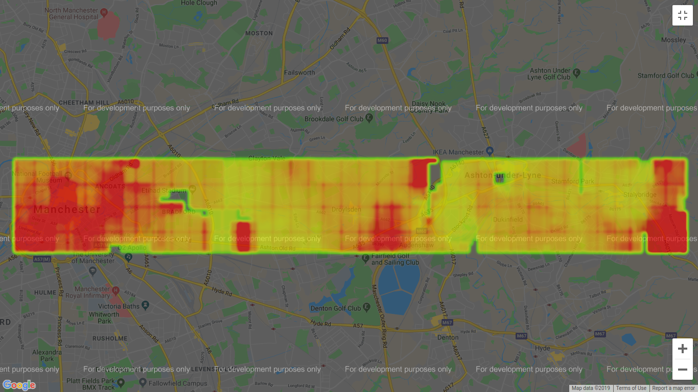

# Property Price Evaluator

Produces a heatmap of property values for a specific property description across the UK.

## The problem with existing heatmaps

Many property value heatmaps available online show the average property price for all properties in an area. This means that the map is heavily influenced by property types that the stakeholder does not necessarily care about and the map simply becomes one displaying general affluence.

## How this heatmap differs

By calculating the average property prices in an area using only properties that match a specific description (number of bedrooms, property type, etc), it is much easier to visualise which locations offer best value for money for a property of specific criteria.

For example, if I required a semi-detached house with 3 bedrooms, if there existed a location where there were 2 matching properties priced well below market average, this would not be apparent on a heatmap if these houses were amongst several 6 bedroom detached houses because this area happened to be particularly affluent. This heatmap combats this as the only factor in plotting for the heatmap is the 2 semi-detached properties.

# Samples

The heatmap intensity is relative to the highest and lowest points within the entire selected area. Therefore large selections provide a generalised view of value:

... and redrawing with a restricted selection can provide more detailed view of areas of interest:

